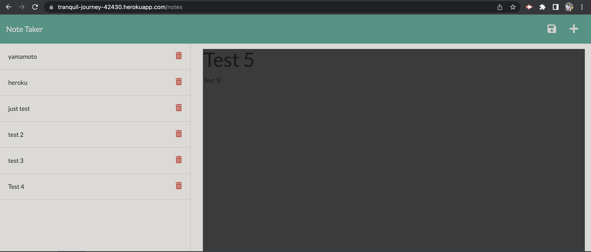

# NOTE TAKER 
 Express.js app for Challenge 11.

## INSTALLATION AND UPDATES MADE:
1. The page was built using mainly express.js. Deployed using Heroku and is hosted on Heroku. Link , screenshot and the screen shot are attached herewith.

a) 
b) link to github pages (https://github.com/druharo/note-taker)
c) Link to the live site (https://druharo.github.io/note-taker/)
d) Link to Heroku Deployment (https://tranquil-journey-42430.herokuapp.com/notes)

2. Key changes were made and pushed to heroku cloud application platform,  initial  commits, generating notes api, get, post and delete, updating the URLs (GitHub, Site and Heroku links) and deployment to heroku cloud application platform.

3. A number of challenges were encountered during the development of the site especially with the amount of work needed to make it work that required alot of research back and forth. 

## MOTIVATION:
The main motivation of was to develop a Note Taker that can be used to write and save notes that will aid my business processes.

## LICENSES:
The code has an MIT License.

## CREDITS:
UMN Bootcamp Tutoring Staff, https://devcenter.heroku.com/categories/reference, http://expressjs.com/en/api.html#path-examples, https://www.npmjs.com/package/uuid, https://nodejs.org/api/fs.html
